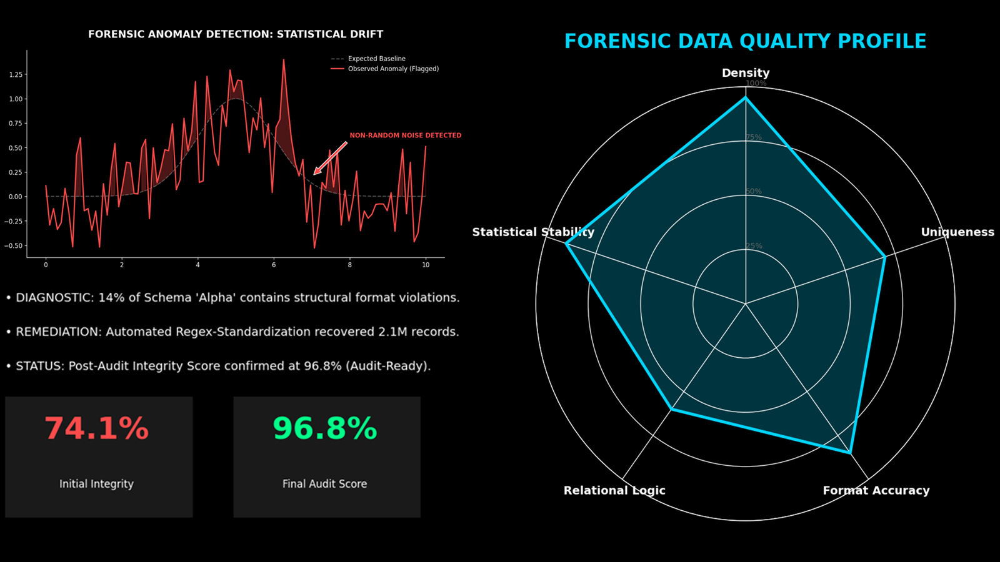

# Universal Data Integrity: Forensic Gatekeeper Engine

## Strategic Intent: Forensic vs. Descriptive Data Quality

How do you establish mathematical trust in raw datasets before they feed high-stakes models, executive reporting, or regulatory analytics?

I engineered this Python-driven diagnostic engine to act as an automated intake audit for raw data. The system is designed to identify forensic anomalies that traditional descriptive data-quality checks often miss, including hidden null-equivalent strings, dominant-bias patterns, format inconsistencies, and zero-information fields.

The objective is simple: prevent corrupted or structurally weak data from reaching downstream models, dashboards, or executive decision processes.

This project demonstrates a practical data-governance principle:

> Data quality should not be a vague technical concern.  
> It should be converted into a measurable integrity score, a remediation map, and an audit-ready executive narrative.

---

## Executive Dashboard

[](./docs/executive_dashboard_preview.png)

[Open dashboard full size](./docs/executive_dashboard_preview.png)

The executive dashboard translates column-level forensic diagnostics into a leadership-ready view of dataset health, remediation potential, and final audit readiness.

---

## The Gatekeeper Framework

### 1. Forensic Anomaly Detection

The engine identifies structural data-quality issues that can survive ordinary profiling:

- hidden null-equivalent strings such as `none`, `N/A`, `???`, `.`, and blank strings
- high null density
- dominant-value bias
- zero-variance columns
- inconsistent string formats or lengths

These checks are designed to find corruption patterns, not just obvious missing values.

### 2. Multi-Dimensional Quality Scoring

Each column receives a weighted integrity score based on detected issues.

The current scoring framework evaluates:

- density risk
- format inconsistency
- dominant bias
- zero variance

The dataset-level score is calculated as the average of the column integrity scores.

### 3. Simulated Remediation Potential

The engine distinguishes between repairable and structural issues.

Repairable issues, such as density and format inconsistencies, are used to estimate a simulated post-remediation score. This gives stakeholders a practical view of how much audit readiness can improve if known defects are addressed.

### 4. Audit-Ready Output

The engine produces two forms of stakeholder evidence:

- an Excel-based forensic audit ledger for technical owners
- a PowerPoint executive scorecard for decision-makers

This supports the “No Cold Handoffs” standard: executives see the health signal, while developers and data owners see the repair map.

---

## Executive Interpretation

### Garbage-In, Garbage-Out Risk

Data science is only as reliable as the data it consumes. This engine acts as a gatekeeper that prevents corrupted, biased, or structurally weak data from reaching downstream analytics.

### Forensic vs. Descriptive Quality

Standard profiling tools often identify missing values and summary statistics. This engine focuses on forensic failure modes: hidden null-like values, dominant-bias patterns, inconsistent formats, and structurally non-informative fields.

### Reducing Technical Debt at Intake

It is far cheaper to fix data at the intake stage than to remediate a model, dashboard, or regulatory analysis after incorrect outputs have already been produced.

### Quantifiable Integrity Score

The integrity score converts data-quality review into a measurable business signal. Stakeholders receive a clear Go / No-Go metric for whether a dataset is ready for downstream use.

### Multi-Channel Reporting

The engine supports both executive and technical reporting:

- executive scorecard for leadership review
- forensic audit ledger for remediation owners
- column-level health chart for visual inspection

---

## Technical Architecture

### Core Engine

Primary source file:

[`src/forensic_diagnostic_engine.py`](./src/forensic_diagnostic_engine.py)

The executable core is implemented as a class-based diagnostic engine:

```python
DataForensicEngine
```

The engine accepts a pandas DataFrame, audits each column, calculates column-level scores, calculates a dataset integrity score, estimates remediation potential, and generates visual / reporting artifacts.

### Configurable Thresholds

The engine centralizes key controls:

```python
NULL_THRESHOLD = 0.20
FORMAT_DEVIATION_LIMIT = 0.05
BIAS_THRESHOLD = 0.99
```

These thresholds allow the audit posture to be tuned for different enterprise environments or risk tolerances.

### Weighted Scoring Model

Column-level deductions are governed through explicit weights:

```python
WEIGHTS = {
    "Density": 0.30,
    "Format_Inconsistency": 0.25,
    "Dominant_Bias": 0.20,
    "Zero_Variance": 0.25
}
```

This creates a transparent scoring methodology rather than an opaque quality label.

### Hidden Null Detection

The engine identifies null-like strings that can bypass standard `.isnull()` checks:

```python
STRING_NULLS = ['nan', 'null', 'na', 'n/a', 'undefined', '???', '.', '']
```

This is especially important in enterprise data pipelines where bad inputs may be encoded as strings instead of true nulls.

### Remediation Potential

The remediation simulation assumes density and format issues are repairable, while dominant bias and zero variance are treated as structural issues.

This distinction helps teams prioritize engineering effort:

- repairable defects can increase the audit score
- structural defects may require data-source, feature, or business-process review

### Reporting Outputs

The engine can export:

| Output | Purpose |
|---|---|
| `Forensic_Audit_Ledger.xlsx` | Column-level audit ledger with scores, statuses, alert types, and forensic rationale |
| `Executive_Scorecard.pptx` | Executive scorecard with dataset integrity score, remediation potential, and visual column-health summary |

---

## How to Run

Install dependencies:

```bash
pip install pandas numpy matplotlib python-pptx openpyxl
```

Run the demo engine:

```bash
python src/forensic_diagnostic_engine.py
```

The script includes a demo dataset with intentional forensic flaws, including:

- format inconsistency
- dominant bias
- high null density
- hidden null-equivalent strings
- clean control fields

By default, the demo prints the current dataset integrity score and simulated post-remediation score.

To export the Excel audit ledger and PowerPoint scorecard, call or uncomment:

```python
engine.export_to_excel("Andrew_Goad_Forensic_Audit.xlsx")
engine.export_to_pptx("Executive_Data_Scorecard.pptx")
```

---

## Repository Structure

```text
forensic-data-integrity/
│
├── README.md
│
├── docs/
│   └── executive_dashboard_preview.png
│
└── src/
    └── forensic_diagnostic_engine.py
```

---

## Data Privacy and Interpretation Boundaries

All data and visual outputs in this repository are generated from synthetic or anonymized datasets to protect proprietary information.

This framework demonstrates methodology for high-stakes enterprise and regulatory environments, but it does not expose real customer data, proprietary data-quality rules, confidential model inputs, or regulated production pipelines.

Important interpretation boundaries:

- The integrity score is a diagnostic metric, not a regulatory certification.
- The remediation potential is a simulated estimate, not a guarantee of production remediation.
- The demo dataset is intentionally flawed to illustrate forensic detection logic.
- The framework is designed for intake review, governance triage, and stakeholder communication.

---

## Portfolio Philosophy

**No Cold Handoffs** — engineering zero-defect, audit-ready results so stakeholders internalize the underlying “why.”

This project is designed to ensure that data-quality findings are not trapped inside technical outputs. The goal is to translate forensic diagnostics into clear, defensible, stakeholder-ready evidence before downstream analytics depend on the data.
